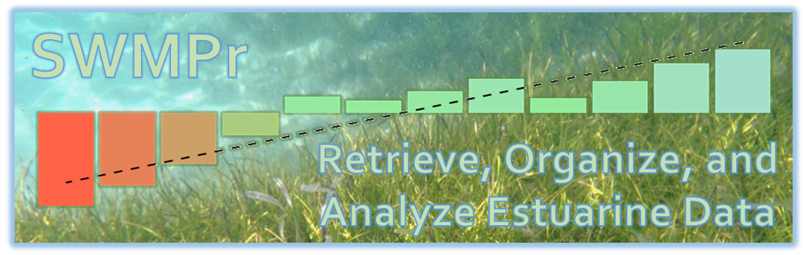

# README

The System Wide Monitoring Program ([SWMP](http://nerrs.noaa.gov/RCDefault.aspx?ID=18)) was implemented by the National Estuarine Research Reserve System ([NERRS](http://nerrs.noaa.gov/)) in 1995 to provide continuous monitoring data at over 140 continuous monitoring stations in 28 estuaries across the United States.  SWMPr (pronounced "swamper") is an R package for retrieving, organizing, and analyzing estuary monitoring data from SWMP.

See the [website](http://fawda123.github.io/SWMPr) for additional information.

# Issues and suggestions

Please report any issues and suggestions on the [issues link](https://github.com/fawda123/SWMPr/issues) for the repository.

A guide to posting issues can be found [here](.github/ISSUE_TEMPLATE.md).

# Contributing

Please view our [contributing](.github/CONTRIBUTING.md) guidelines for any changes or pull requests.
